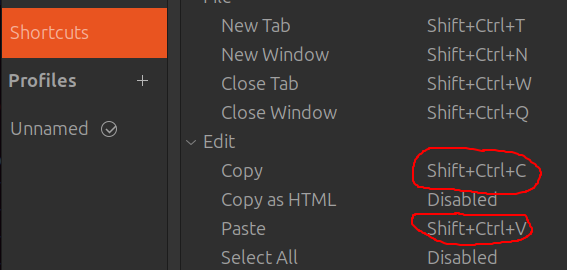
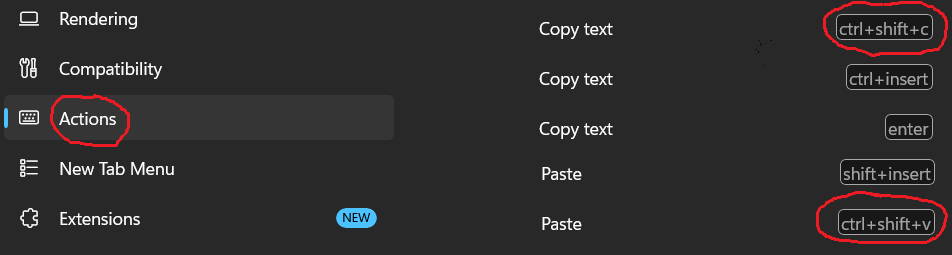

A terminal password manager: minimal and auditable.

# Use of Generative AI
This project is free of contributions generated by large languages models (LLMs) and chatbots.


# Technologies
From the [Rust Crypto LandScape](https://github.com/rustcrypto), we use
* kdf argon2 for password hardening
* `ChaCha20Poly1305` for encryption

For the terminal user interface (TUI), we use [ratatui-textarea](https://crates.io/crates/ratatui-textarea).

# Tested Releases

1. Gnome Desktop Ubuntu 24.04.4 LTS
2. WSL2 Ubuntu 24.04.4 LTS
3. ssh shell from (1) and (2) into CentOS Linux 7

# Install

Either
```
git clone https://github.com/decatur/ratatui-vault.git
cd ratatui-vault
cargo build
```

or
```
cargo install ratatui_vault
```

# Edit a Vault

```
cargo run edit sample_vault
# Please enter password: a-a-a-a-
```
## Keyboard Shortcuts

These are the shortcuts added to, or modified from, the [ratatui-textarea default](https://docs.rs/ratatui-textarea/latest/ratatui_textarea/#minimal-usage):


| Key     | Actions |
| --------| ------- |
| CTRL+V  | Paste from yank buffer, i.e. not from clipboard. |
| CTRL+G  | Generate a passphrase at the cursor location. |
| CTRL+F  | Find regular expression in document. |
| CTRL+Q  | Exit the editor and prompt if modification should be saved. |

# Dump

```
cargo run dump sample_vault`
# Please enter password: a-a-a-a-
# ->
# [Hello-World]
# user = Foo
# pwd  = Bar
```

# Query

You can query the pwd field of a section (supports toml-like section header), for example
```
cargo run query sample_vault 'Hello-World'
# Please enter password: a-a-a-a-
# ->Generate a passphrase at the cursor location
# user=Foo
# pwd=Bar

# Or assign to variables
source <(cargo run  query sample_vault 'Hello-World')
echo $user
# -> Foo
```

# Backup Vault File in the Cloud

Upload with
```
remote_name=sample_vault_$(date +%Y-%m-%d)
echo "Upload to $remote_name"
scp sample_vault my_user@my_server:~/${remote_name}
```

Download with
```
scp my_user@my_server:~/sample_vault_2026-03-14 ~/sample_vault_2026-03-14
```

# TODO: Git Credential Storage

See [Credential Storage](https://git-scm.com/book/en/v2/Git-Tools-Credential-Storage.html#_credential_caching)

# Alternatives

vim -> :help cryptmethod

# Walkthrough Copy/Paste with ratatui-textarea

The story of Copy/Paste with system clipboard integration is complex and counter inTUItiv.
Trying to implement this head on can be a really painful experience.

## Guides

* Accept that a conventional/easy solution does *not* exist.
* Use `crossterm::event::DisableMouseCapture` (this is the default)
* Early test in remote ssh shell (as there is no remote clipboard api).
* Adapt mental model of a yank-buffer *and* a clipboard.
* Select texttodo to be copied to clipboard with your mouse.
* Map Copy to clipboard and Paste from clipboard shortcuts in your terminal to CTRL+SHIFT+C and CTRL+SHIFT+V.
* Use Copy to yank-buffer and Paste from yank-buffer shortcuts CTRL+C and CTRL+V.

## Terminal Settings

### Gnome Terminal Settings



### WSL2 Terminal Settings




## Misguide

⚠⚠ Do *not* follow any of these ⚠⚠

* Directly talk to the clipboard API, e.g. via `arboard`
* Configure the terminal to use the `ratatui-textarea` internal yank keys.
* Disable your terminal mouse selection by setting `crossterm::event::EnableMouseCapture`.
* Trap `SIGINT` in the shell or in the App (e.g. via the CtrlC crate). 

## Rationals

```https://asciiflow.com
┌────────────────────────────────┐                              
│       Terminal Emulator        │                              
│                                │                            
│ ┌────────────────────────────┐ │    Copy     ┌───────┐  
│ │       Terminal App         │ ├────────────►│ Clip- │  
│ │                 ┌────────┐ │ │◄────────────┤ board │  
│ │           yank  │  Yank  │ │ │    Paste    └───────┘  
│ │         ◄──────►│ Buffer │ │ │                            
│ │                 └────────┘ │ │                              
│ └────────────────────────────┘ │                              
└────────────────────────────────┘                              
```

The interface to the system clipboard is provided by the terminal emulator.
This is true even if the terminal app runs remotely via ssh.
A terminal app has no means to access this clipboard via its hosting emulator.
